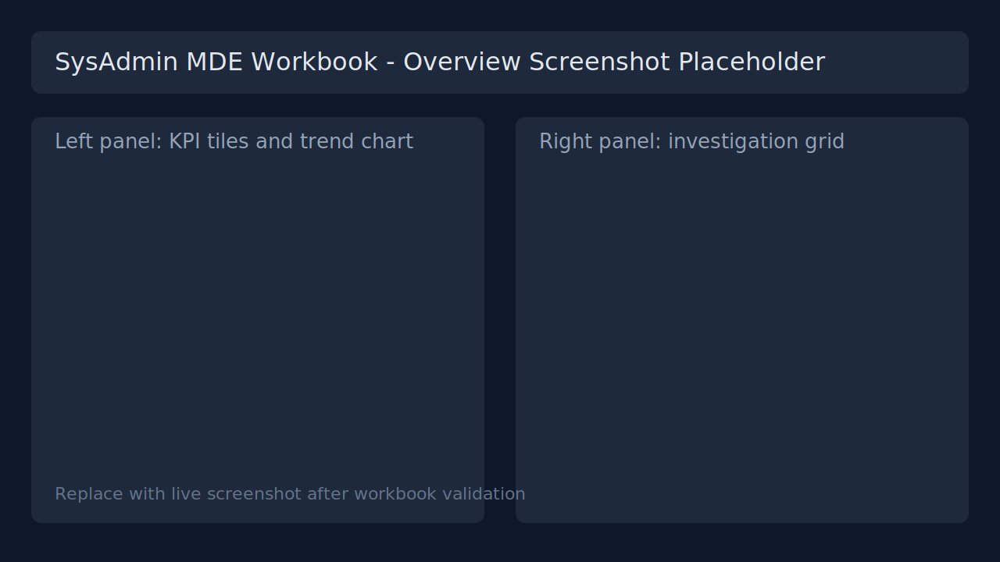
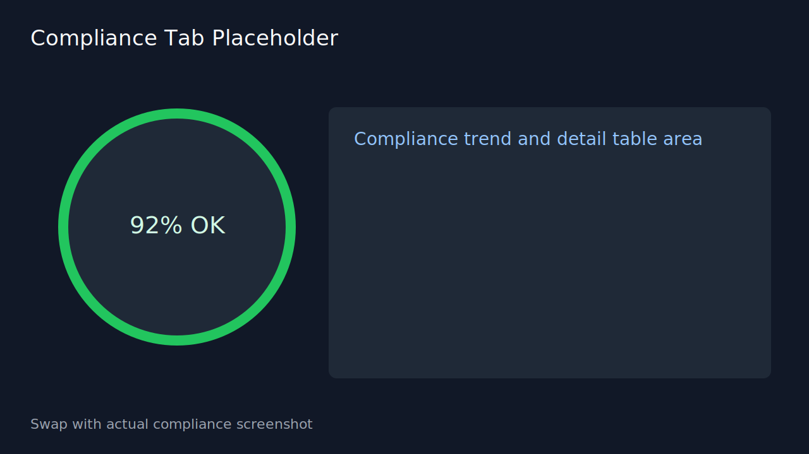
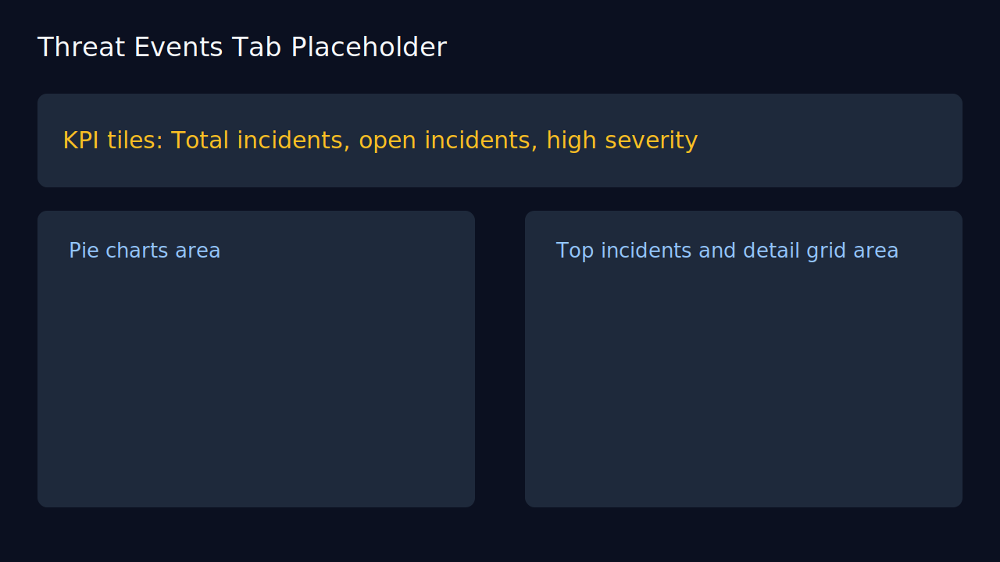

# SysAdmin MDE Deployment Workbook

## Intro
This package publishes a Microsoft Sentinel workbook focused on SysAdmin and MDE operational visibility.

It is designed for quick deployment and easy day-1 use with:
- Compliance posture views
- EDR and AV sensor health views
- Threat event summaries
- DLP USB activity views
- Intune firewall policy evidence views

## Summary For SOC And CISO
This workbook gives SOC teams fast operational triage while also giving CISO leaders clear risk posture trends.

- SOC focus: Find unhealthy endpoints, identify detection spikes, and prioritize remediation.
- CISO focus: Track coverage, compliance, and operational effectiveness over time.

### Tab Breakdown
| Tab | SOC Use | CISO Use |
|---|---|---|
| Compliance | Find non-compliant systems by last check-in and prioritize follow-up. | Measure enterprise endpoint compliance rate and trend. |
| EDR Sensor | Detect inactive or unhealthy EDR sensors before blind spots grow. | Confirm sensor health baseline across the environment. |
| AV Sensor | Validate AV telemetry presence and identify stale/non-reporting devices. | Verify anti-malware coverage effectiveness at a glance. |
| EDR/AV Install Status | Separate devices into EDR+AV, AV only, EDR only, and no coverage groups. | Understand tooling coverage gaps and exposure concentration. |
| Firewall Events | Triage blocked/allowed patterns and investigate suspicious network behavior. | Review firewall activity posture and abnormal activity growth. |
| Threat Events | Investigate incidents, severities, and source concentration quickly. | Track top threats, incident volume, and high-severity burden. |
| DLP Events | Review USB/removable media events and potential exfiltration signals. | Monitor data protection control effectiveness and policy pressure. |
| Intune Compliance | Correlate FW policy assignment with sync/compliance evidence. | Validate policy rollout quality and follow-up performance. |

## Screenshot Placeholders
Use these placeholders now, then replace each file with live screenshots after final validation.

### Workbook Overview

### Compliance Tab

### Threat Events Tab

## Prerequisites
- A Microsoft Sentinel-enabled Log Analytics workspace
- Permissions to deploy ARM templates in the target resource group
- Reader access to relevant Microsoft Defender XDR data tables

## The Structure
This folder contains:
- SysAdmin-MDE-Deployment-Workbook.workbook: Workbook JSON payload for manual import
- azuredeploy.json: One-click ARM deployment template (Commercial + Gov)

## How To Deploy
Use one of the deployment buttons below.

### Deployment Inputs
When the deployment blade opens, provide:
- workspaceName: SOC-Central (or your target workspace name)
- workbookDisplayName: SysAdmin MDE Deployment Workbook (or your preferred title)
- workbookName: SysAdmin-MDE-Deployment-Workbook (or your preferred resource name)

## Manual Import (Portal)
1. Go to Microsoft Sentinel in your target workspace.
2. Select Workbooks, then New.
3. Open Advanced Editor.
4. Paste the contents of SysAdmin-MDE-Deployment-Workbook.workbook.
5. Apply and Save.

## How To Use
1. Select the time range at the top.
2. Use tabs to switch domains:
- Compliance
- EDR Sensor
- AV Sensor
- EDR/AV Install Status
- Firewall Events
- Threat Events
- DLP Events
- Intune Compliance
3. Use table filters and export options for triage and reporting.

## Notes
- The workbook uses fixed compliance windows in selected visuals and a global time picker for trend/detail views.
- If data appears delayed after deployment, allow several minutes for table refresh and workbook rendering.
